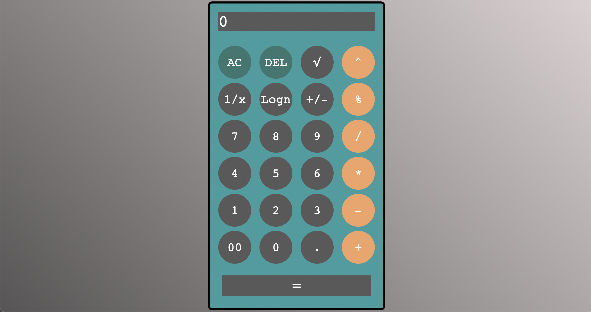

# JavaScript Calculator

This is a simple calculator implemented in HTML, CSS, and JavaScript. It provides a user-friendly interface for performing basic arithmetic operations, and you can use your keyboard too!

This is the final project for The Odin Project.

## Features

- Basic arithmetic operations: addition, subtraction, multiplication, division, Powers, Square Roots
- Clear function to reset the calculator
- Handles division by zero
- Logarithms

## Installation

No installation is necessary. Simply clone the repository and open the `index.html` file in your web browser to use the calculator.

```bash
git clone git@github.com:CypherGuy/Calculator.git
```

## Usage

Enter numbers into the calculator using the on-screen buttons, then choose an operator to perform a calculation. The result will be displayed on the screen.

## Contributing

We welcome contributions to this project. Please follow these steps to contribute:

1. Fork the repository
2. Create a new branch for your feature
3. Commit your changes to your branch
4. Push your changes
5. Open a pull request

For more information on how to create a pull request, see GitHub's documentation.

## Images



## License

This project is licensed under the MIT License. See the [License](https://opensource.org/licenses/MIT) file for more information.

## Contact

If you have any questions or feedback, please open an issue on this repository.

Have a good day!
